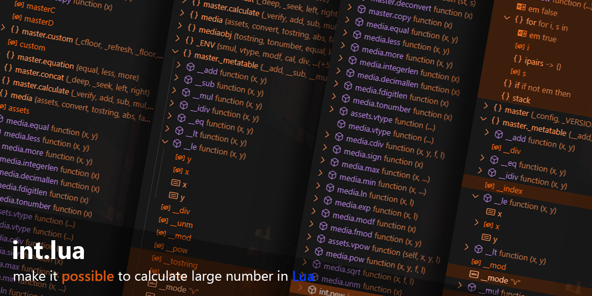

# int


## Enable large-number arithmetic in pure Lua

The **int** module extends Lua capability to handle large numbers.

> [!NOTE]
This project is currently in beta.

Tested with: LuaJIT, Lua 5.1, Lua 5.2, Lua 5.3, Lua 5.4\
Check by [**TestSuite**](testsuite.lua)

---

## how to install

install with package manager:

> [!NOTE]
> Install via LuaRocks (provided by [**lua-uint**](https://github.com/SupTan85/lua-uint)):
>
> ```bash
> luarocks install uint
> ```

**or download the [module](int.lua) and place it in the working directory or any directory in the package path.**

---

## how to use

**First, install the module by download or install with package manager.**\
Let's try import the module with `require` function in Lua

```lua
local int = require("int")
```

Next, to create a new object, you have to use [**int.new**](.doc/int.new.md) function.

```lua
local int = require("int")

local x = int.new("13") -- input can be either a number or a string! *recommend to use string*

print(x) -- output: "13"
```

To use [**calculation operators**](#operators) to calculate math.

> [!CAUTION]
only operator that is supported.


you can do like this:

```lua
-- require a module
local int = require("int")

-- build a new int object
local x, y = int.new("20", "10")

print(x + y) -- output: 30
```

---

## feature

> [!TIP]
Before using any function, make sure to read about its [**performance**](#performance)!

- **Calculate**
  - addition `+`
  - subtraction `-`
  - multiplication `*`
  - division `/`
  - floor division `//`
  - modulo `%`
  - power `^`
- **Equation**
  - equal
  - less than
  - more than
- **Function**
  - exp
  - fact
  - sqrt
  - *and more...*

---

## design


### inside object

This is an example inside [**table**](.doc/type.table.md) of [**int object**](.doc/type.intobj.md).

```lua
local example_intobj_table = {
    -- digit --
    [1] = 1, -- chunk
    [0] = 0,
    [-1] = 1,

    --[[
        << fraction | digit >>
      INDEX: -1 | 0 | 1
      VALUE:  1 : 0 : 1

      TOSTRING: "1.01"
      TONUMBER: 1.01
    ]]
    -- data --
    sign = "+",

    _dlen = -1, -- digit of fraction *this for calculate a fraction* **Internal use only, Do not modify.**
    _size = 1 -- per number size of chunk *just maximum digit per value in the digit chunk* **Internal use only, Do not modify.**
}
```

### inside module



- **master** library for build-in function.
- **media** library for other build-in function. *-- require master*
- **int** library for call function in the module. *-- require master & media*

> [!IMPORTANT]
when you use `require`, `loadfile` or `dofile` function to load the module,\
the module will return only [**table**](.doc/type.table.md) that name **int** only

---

## function & methods

all function is in version: **186**

>[!NOTE]
Recommend to read in visual studio code.

- **module function**
  - int.abs
  - int.ceil
  - [int.cnew](.doc/int.cnew.md) *-- custom int.new function*
  - int.cround
  - int.eqless *-- equal or less than*
  - int.eqmore *-- equal or more than*
  - int.equal
  - int.exp
  - int.fact
  - int.fdigitlen *-- return sum of number integer digits and number decimal digits.*
  - [int.floor](.doc/int.floor.md)
  - int.fmod *-- modulo function*
  - int.decimallen *-- return number of decimal digits*
  - int.integerlen *-- return number of integer digits*
  - int.less
  - int.ln
  - int.max
  - int.min
  - int.modf
  - int.more
  - [int.new](.doc/int.new.md)
  - int.pow *-- power function*
  - int.sign
  - int.sqrt
  - [int.tonumber](.doc/int.tonumber.md)
  - [int.tostring](.doc/int.tostring.md)
  - [int.unm](.doc/int.unm.md)

**Example to call a function:**

```lua
-- require a module.
local int = require("int")

-- build int object.
local x = int.new("14.695")

-- using a custom floor function.
print(int.floor(x, 2)) -- output: 14.69
```

---

- **methods**
  - abs
  - ceil
  - cround
  - eqless *-- equal or less than*
  - eqmore *-- equal or more than*
  - equal
  - exp
  - fact
  - fdigitlen *-- return sum of number integer digits and number decimal digits.*
  - [floor](.doc/int.floor.md#methods)
  - fmod *-- modulo function*
  - decimallen *-- return number of decimal digits*
  - integerlen *-- return number of integer digits*
  - less
  - ln
  - max
  - min
  - modf
  - more
  - pow *-- power function*
  - sign
  - sqrt
  - [tonumber](.doc/int.tonumber.md)
  - [tostring](.doc/int.tostring.md)
  - [unm](.doc/int.unm.md)

**Example to call a function:**

```lua
-- require a module.
local int = require("int")

-- build int object.
local x = int.new("14.695")

-- using a custom floor function.
print(x:floor(2)) -- output: 14.69
```

---

## operators

- **Calculation**
  - addition `+`
  - subtraction `-`
  - multiplication `*`
  - division `/`
  - floor division `//` *-- some versions of Lua do not support (require Lua 5.3 >=)*
  - modulo `%` *-- some versions of Lua do not support (require Lua 5.1 >=)*
  - power `^` *-- some versions of Lua do not support (require Lua 5.1 >=)*

**Example to using a calculation operator:**

```lua
local int = require("int")

local x, y = int.new("4", "2")

print(x / y) -- output: 2
```

> [!IMPORTANT]
some version of Lua you can use calculation operator with number & string

---

- **Equation**
  - `==` equal
  - `<=` equal or less than
  - `>=` equal or more than
  - `<` less than
  - `>` more than

**Example to using a equation operator:**

```lua
local int = require("int")

local x, y = int.new("4", "2")

print(x > y) -- output: true
```

> [!IMPORTANT]
some version of Lua you can use equation operator with number & string

---

## performance

> [!NOTE]
Lua didn't support hyper threading system, mean we can't use full performance of cpu!\
**however some function not support hyper threading system.*

- **Calculation**
  - `+` **addition &** `-` **subtraction** - very fast
  - `*` **multiplication** - fast
  - `/` **division &** `//` **floor division** - slow
  - `%` **modulo** - slow
  - `^` **power** - very slow

- **Equation** "difference is a factor."
  - `==` **equal** - very fast
  - `<=` **equal** or **less than** - very fast
  - `>=` **equal** or **more than** - very fast
  - `<` **less than** - very fast
  - `>` **more than** - very fast

- **ETC**
  - `media.unm` Negation - very fast
  - `media.sqrt` Square root - slow
  - `media.ln` Natural logarithm - very slow
  - `media.exp` Exponential - very slow

---

## limit

- some function won't support a extremely large values.

- on Lua version `5.1` maximum value of `_size` is `8`.

---

> [!NOTE]
reason why this module name is "int"? because in this module always use integer to calculate math,\
and feel free to use!\
**version: 186 - 5**


